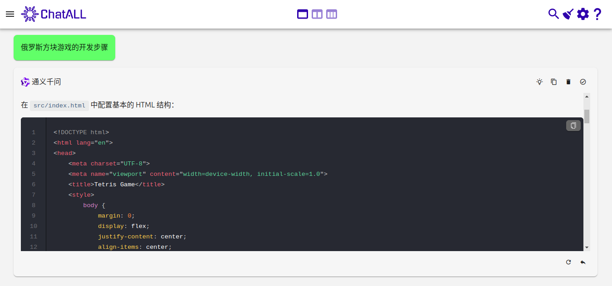
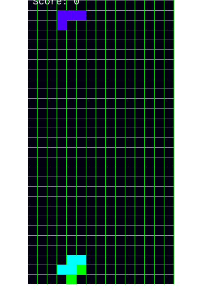

### 项目的由来与愿景

- 最近，我和童年的老朋友们聚在一起侃大山。从股市的起起伏伏，到中美关系的微妙变化，再到俄乌战争的紧张局势，
  我们的话题跳跃而广泛。但最让我们怀念的，还是那些无忧无虑的童年时光，尤其是我们一起沉迷于俄罗斯方块的日子。
  记得最清楚的是，我们争抢着手柄，没抢到的就在一旁捣乱指挥，玩的人常常在嘻嘻哈哈中迅速败下阵来。
  那时候，我总梦想着一个可以无限玩下去的方块游戏，让那些等待的小伙伴们望尘莫及。

- 岁月匆匆，我们都已长大，那段童年时光虽已无法找回，但我们可以通过chatAI实现那个小小的童年愿望——打造一个能无限畅玩的俄罗斯方块。哈哈，想想都有些小激动。本文就是分享使用chatAI来实现这个小游戏的过程。

- 希望这款游戏能唤起您对儿时的美好回忆，同时，也将不断加入新的有趣玩法，为您在这瞬息万变的世界中，提供一个放松心灵的栖息之地。如果您对这款充满情怀的小游戏感兴趣，不妨关注苒芃公众号，并在后台留言“方块”。
  您会在第一时间获取到这个小游戏的进展情况和新玩法。

### 先说说什么是chatAI

1. chatAI：对话功能的通用术语
   chatAI泛指具有对话功能的大语言模型，并不特指某个具体的模型。
   这些模型通过复杂的算法和大量的训练数据，能够与用户进行自然流畅的对话，提供各种信息和服务。

2. 大语言模型的本质与选择
   大语言模型本质上是概率模型，每个模型都有其独特的优势和适用场景。
   因此，不能简单地说某个模型是最好的。尽管OpenAI的ChatGPT在整体表现上较为突出，但在不同的任务上，尤其是中文任务，仍需进行多方面的比较。每种模型都有其专长，要根据不同的任务选择合适的模型，才能更好地满足具体需求。

3. 推荐工具：chatALL
   在这里，我要特别推荐孙志刚老师开发的工具——chatALL。这款工具能够同时访问多个大语言模型，为用户提供更全面和灵活的交互体验。通过chatALL，你可以轻松地对比不同模型的表现，根据自己的需求选择最适合的答案。希望这款工具能帮助你在与大语言模型的交互中，获得更多的灵感和便利。

4. 把大模型当人看
   在使用chatAI的过程中，我越来越体会到孙志刚老师的一句话：“把大模型当人看。”
   这句话深刻地揭示了与大语言模型交互的最佳方式——像与真人交流一样，理解它们的特点和局限，从而更好地利用它们的能力。

### 再使用chatAI选择一个游戏引擎

1. 赋予AI角色：H5游戏的高级研发工程师
   我们需要给chatAI赋予一个角色——H5游戏的高级研发工程师。
   这样，拥有丰富经验和深厚技术功底的AI工程师就能为我们推荐最适合的H5游戏引擎。

2. Phaser3：初学者的福音，多平台的利器
   当我们将这个任务交给AI时，大多数AI都不约而同地推荐了Phaser3。Phaser3是一款原生的H5游戏引擎，以其对初学者特别友好的特性而著称。它不仅易于上手，还能通过少量的修改适配各个平台的小游戏，让你的游戏轻松发布到多个平台，触及更广泛的用户群体。

3. 跟随AI导师，掌握Phaser3的精髓
   最后，我们给AI赋予Phaser3教师的角色，跟随这位经验丰富的导师，一步步学习如何使用这款强大的引擎。
   无论你是游戏开发的新手，还是有经验的开发者，都能在AI的指导下，快速掌握Phaser3的核心要点，开启你的H5游戏创作之旅。
   
   为了更高效地开发，现阶段只需要掌握Phaser3中关于游戏的一些基本概念，如Game,Scence,Graphics,Rectangle等这些初始化和画图相关的概念。

### 最后使用chatAI编程实现

##### 1.直接询问chatAI俄罗斯方块游戏的开发步骤

- 一般chatAI会给出比较详细的步骤，比如通义千问的回答如图1
  
  

- 并且还给出了比较详细的代码，如图2
  
  

- 虽然按照步骤能实现，但是其代码却有好些需要修改的地方

##### 2.接着按照步骤一步步地完成游戏开发

###### 2.1 准备工作

这一步主要是安装游戏引擎Phaser和创建项目文件，最重要是创建项目入口HTML文件，如图3

###### 2.2 初始化 Phaser 游戏

这一步主要是引入Phaser后初始化和配置Phaser，如图4

###### 2.3 创建游戏界面

这一步主要是创建游戏网格，初始化游戏背景，如图5

###### 2.4 创建方块

这一步主要是定义方块类型，并创建一个方块类来管理方块的显示和逻辑，如图6

###### 2.5 添加游戏逻辑

这一步主要是创建方块，使其能下落，旋转和堆积等游戏逻辑，并且添加键盘事件监听，使玩家能操作方块，如图7

###### 2.6 消除行

这一步主要是添加消除满行的游戏逻辑并更新记录，如图8

2.7 游戏结束
这一步主要是判断游戏是否结束，因为要做无限玩，所以这个判断去掉了。

### 测试和调试

运行项目并进行测试，确保所有功能正常工作。你可以使用浏览器的开发者工具来调试和优化代码。虽然AI给出了游戏框架和代码，但是有一些细节并不能真正运行，还需要调试修改才能真正运行起来。

1. 初始化运行发现背景方格并没有铺满，如图9，这是因为方格大小为20x20,总共10x20,并没有铺满300x600的屏幕，修改方格数量为15x30就可以了。
   
   

2. 方块的初始位置并没有和网格对齐，如图10，这是方块初始位置的坐标原点不在top-left，需要在创建方块后增加调用block.setOrigin(0);修改方块的坐标原点。
   
   

3. 左右移动后，形状就显示不全了，如图11，这是因为形状整体做移动会有问题，只需要将形状中的所有方块逐个做移动就可以了。
   
   

4. 每次按键后处理都是随机次数的，这是将按键处理放到了游戏显示更新函数中，只需要注册按键逻辑到键盘事件监听中，如图12。
   
   

5. 形状旋转后，并没有清除原来形状的显示，如图13，这是形状在旋转后并没有清理原来方块，直接创建了新的方块，只需在创建新方块之前，销毁当前的方块就可以了。
   
   

6. 方块并不能自动落下，这是在显示更新逻辑中，根据lastFallTime变量来判断当前是否要向下移动，但是没有为lastFallTime初始化，将其初始化为0就可以了。

7. 方块落下过程中没有到底就停止了，并且出现新方块，如图14，虽然改好了方块的显示，但是方块的移动判断逻辑中还使用默认网格为10x20，需要修改为15x30。
   
   

8. 方块落下后会产生重叠，如图15，这是移动判断逻辑中方块的重叠判断中，在计算网格位置时没有从0开始算起点，导致方块总是重叠一个位置。
   
   

9. 在方块堆积成行后却没有清除该行，如图16，这是在网格中虽然已经将该行消除，但是在显示中却没有清除该行的方块，只需要将保存在网格中的方块销毁并清理其显示就可以了。
   
   

10. 在方块堆积成行后，该行数据和显示都已经清理了，但是上面的方块的显示却没有往下移动填满消除后的网格，如图17，这是网格中虽然已经将上面的方块往下移动了，但是其显示位置却还没有更新，和上一个问题类似，只需要在消除行后，更新一下现在网格中方块的显示位置就可以了。
    
    

### 结果分享

虽然AI生成了大部分代码，但是却有不少的问题，解决这些问题如果要是没有编程知识是很难处理的，因此AI是“一个很粗心的人”，其生成的内容还需要细心而有逻辑的检查才行。
如果你想获取到代码可以添加苒芃公众号，回复“源码”就会发送链接。
你也可以访问[试玩](https://ranpeng.fun/tetris/main.html)。

### 后续的想法

- 如果没有编程经验很难找到并解决AI生成代码的bug，也许智能Agent可以，有时间要试一试。
- 这个0.1版本虽然可玩，但是没有做到无限玩，这需要进一步开发了。
- 游戏界面看上去太丑了，要添加一些素材才行。
- 暂时想到这么多，我会持续开发这个休闲小游戏，如果你想分享有意思的玩法，可以关注苒芃公众号，然后发消息给我。
